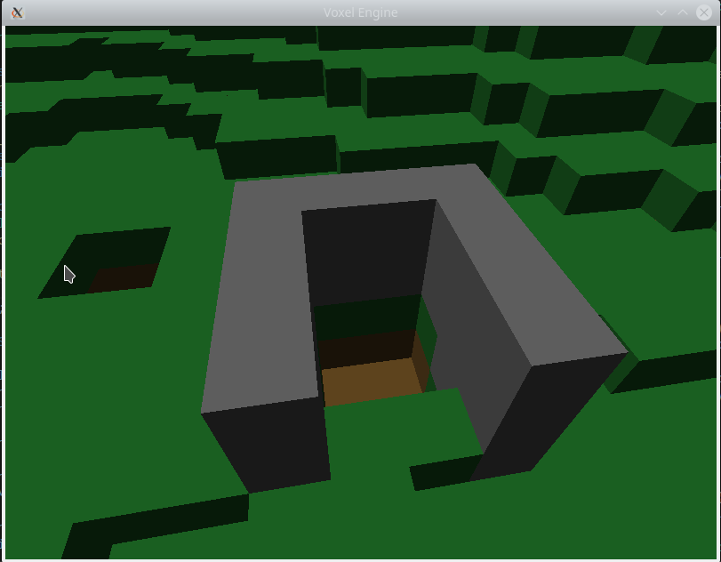
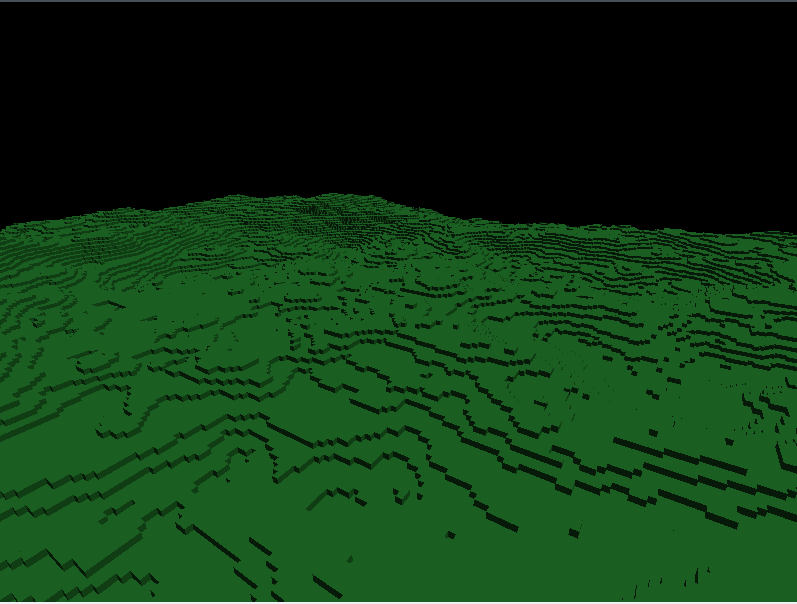

# Voxel Engine

## Description

3D Voxel rendering engine written in C++ using OpenGL. Includes an infinitely spanning, randomly generated, chunk-based world. 

Chunks are rendered through greedy meshing, and further optimized via frustum culling and occlusion culling. There is an octtree with support for mouse picking, and the ability to both place and remove voxels.

## Images

## Background

Written as a way to improve my skills with profiling and rendering optimization, I started with the least optimized and most naive solution to voxel rendering and steadily improved with different methods, such as greedy meshing, multithreading, and improved data layouts to get better framerates with larger amounts of voxels.

## Building / Usage

Uses GCC and GNU Make. Good luck.

## Future Work

- Further improvements to rendering
- Replace OpenGL with Vulkan

